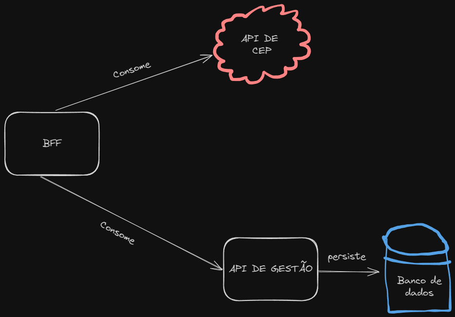

# Minha API

Essa API possui o CRUD de endereços, onde é possível cadastrar, listar, atualizar e deletar endereços.

E um CRUD de usuários, onde é possível cadastrar, listar, atualizar e deletar usuários.

---
## Como executar 


Após instalar o docker, execute o comando abaixo para criar a imagem do container:

```bash
docker build -t gst-endereco .
```

Após criar a imagem, execute o comando abaixo para criar o container:

```bash
docker run --name gst-endereco -p 5000:5000 gst-endereco
```

## Arquitetura


